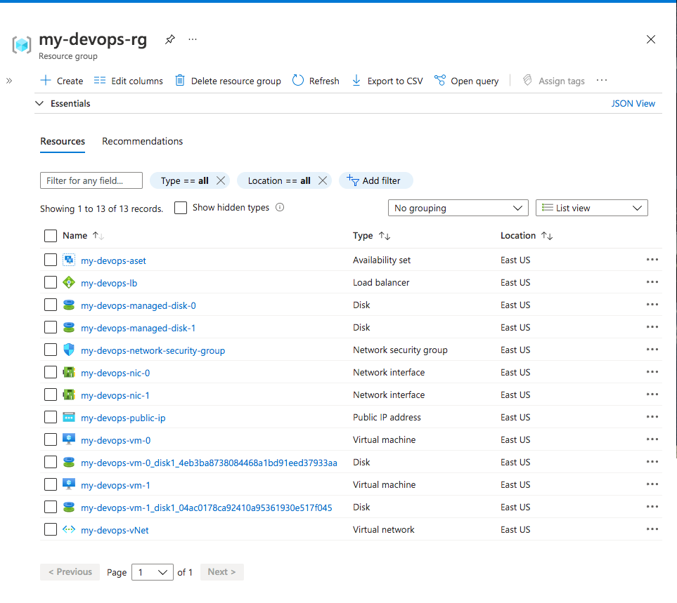

# Azure Infrastructure Operations Project: Deploying a scalable IaaS web server in Azure

### Introduction
This project aims to deploy related resources like virtual machines, load balancer and etc. via Infrastructure as Code using Terraform and Packer.

### Getting Started
1. Clone this repo
2. Create a free Azure Account
3. Create a resource group to upload the packer image.

### Dependencies
1. Create an [Azure Account](https://portal.azure.com) 
2. Install the [Azure command line interface](https://docs.microsoft.com/en-us/cli/azure/install-azure-cli?view=azure-cli-latest)
3. Install [Packer](https://www.packer.io/downloads)
4. Install [Terraform](https://www.terraform.io/downloads.html)

### Instructions
Follow the instructions below to run the solution


#### Create and Assign the Policy
1. Navigate to the policy folder
2. In the terminal type:
    ```
    az policy definition create --name tagging-policy --rules deny-policy-when-no-tag.json
    ```
3. To assign the policy to current subscription run:
    ```
    az policy assignment create --policy tagging-policy
    ```

#### Deploy Packer image to the resource group
1. Make sure you had created the resource group (Getting Started Step 3).
2. Make sure you had created the service principal from the [azure portal](https://docs.microsoft.com/en-us/azure/active-directory/develop/howto-create-service-principal-portal)
3. Setup the environment variable via the terminal:
    - export AZ_CLIENT_ID=<SERVICE_PRINCIPAL_CLIENT_ID>
    - export AZ_CLIENT_SECRET=<SERVICE_PRINCIPAL_CLIENT_PASSWORD>
    - export AZ_SUSCRIPTION_ID=<SERVICE_PRINCIPAL_SUBSCRIPTION_ID>
4. Navigate to the packer folder and run the following command:
    ```
    packer build server.jsom
    ```
5. It should create an image named <b>myPackerImage</b> under the <b>udacity-project1-packer-rg</b> resource group. You can verify this by running:
    ```
    az image list
    ```

#### Create and deploy Azure resources using Terraform
1. Navigate to the terraform folder
2. Run:
    ```
    terraform init
    ```
3. Then run
    ```
    terraform plan -out solution.plan
    ```
4. To deploy the resource plan, run:
    ```
    terraform apply solution.plan
    ```
5. It should create and deploy the resource to the specific resource group. You can verify it via the Azure Portal.

** Notes **
There is a file named variables.tf which stores the variables used by this solution. Kindly update these variables to suit your requirments

### Output
After running the instructions above, a new resource group should be created with the following resources inside.


